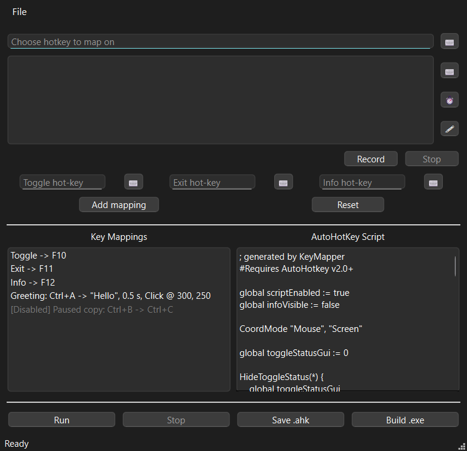

# pyAHK

A Windows desktop automation builder that turns visual hotkey mappings and
recorded input into AutoHotkey v2 scripts.



## Highlights

- Build keyboard, text, mouse, delay, and scroll sequences without writing AHK.
- Assign, validate, enable, disable, name, and repeat hotkey mappings.
- Record keyboard and mouse input, including window-relative click positions.
- Save reusable projects with recovery autosave.
- Preview and run generated AutoHotkey v2 scripts.
- Export `.ahk` files or compile Windows executables with Ahk2Exe.
- Detect duplicate hotkeys and control-key conflicts before generation.

## Technology

- Python
- PyQt6
- AutoHotkey v2
- pynput
- PyInstaller

## Requirements

- Windows 10 or Windows 11
- Python 3.10+
- AutoHotkey v2 for running generated scripts
- Ahk2Exe for optional executable compilation

## Run From Source

```powershell
py -m venv .venv
.\.venv\Scripts\Activate.ps1
python -m pip install -r requirements.txt
python main.py
```

## Tests

```powershell
$env:QT_QPA_PLATFORM = "offscreen"
python -m unittest discover -s tests -v
```

The test suite covers hotkey parsing, conflict detection, project persistence,
script generation, recording conversion, recovery, repeat behavior, and build
state handling.

## Build

```powershell
python -m PyInstaller --clean pyAHK.spec
```

The packaged executable is written to `dist/` and is intentionally excluded
from the repository.

## Repository Scope

Generated executables, local projects, backups, IDE settings, and build output
are intentionally excluded from version control.

## License

Copyright (c) 2026 Ahmad Jomaa. All rights reserved. See [LICENSE](LICENSE).
